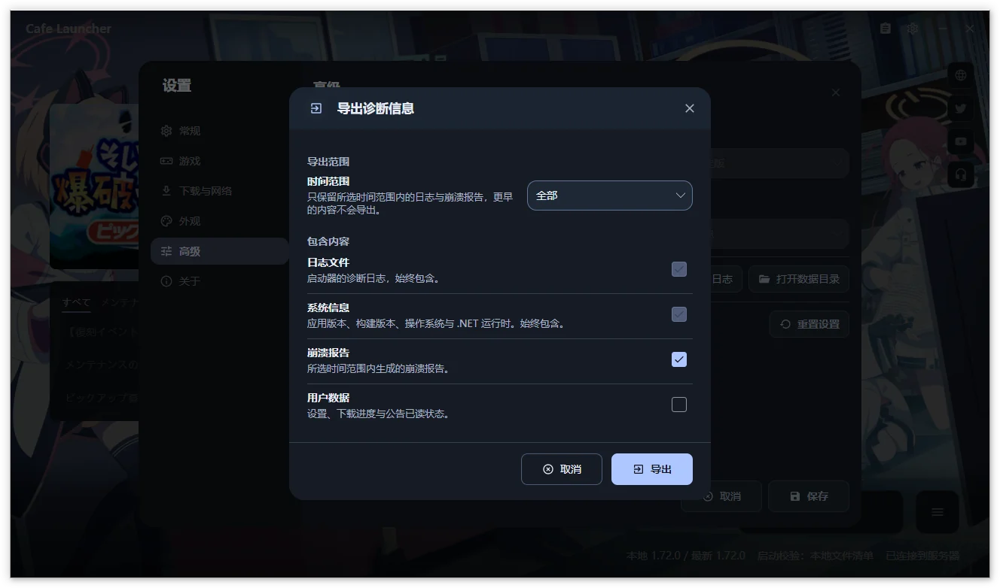

# 常见问题

## 应该下载哪个文件？

Windows 用户优先选择 `setup.exe`；需要便携运行时选择 `win-x64.zip`。Apple Silicon Mac 选择 `osx-arm64.zip`。Linux 根据发行版选择 `.deb`、AppImage 或 `tar.gz`。

带有 `beta` 的版本是测试版。完整对照见[安装与首次使用](/cafe-launcher/installation)。

## v1.1.0-beta.5 启动器无法启动（启动即崩溃）

**症状**：双击启动器后窗口一闪而过或完全不出现。查看日志可见 `System.InvalidOperationException: NoServiceRegistered, Cafe.Launcher.Avalonia.Services.WindowFilePickerService`。

**原因**：v1.1.0-beta.5 首批发布构建早于修复提交，DI 容器中缺少 `WindowFilePickerService` 的具体类型注册，导致启动时解析服务即崩溃。这是构建打包问题，与你的系统环境、杀毒软件或游戏目录无关。

**解决**：beta.5 已在问题发现后修复并重新发布。从[发布页](https://github.com/bluearchive-cafe/Cafe.Launcher.Avalonia/releases)重新下载 beta.5（或更新版本）覆盖安装即可。设置与用户数据保存在独立的数据目录中，覆盖安装不会丢失游戏路径等配置。

不确定自己装的是哪个构建时，可打开数据目录查看日志开头的 `CommitSha`：受影响构建为 `b33915d`，修复后的构建为其之后的提交。

## 可以复用官方启动器下载的游戏吗？

可以。首次向导或“设置 → 游戏”中选择现有 `BlueArchive_JP` 目录。Cafe Launcher 会读取其中的 `manifest.json` 与 `game-launcher-config.json`。

不要同时运行两个启动器，也不要在其中一个正在下载、更新或修复时让另一个修改相同目录。

## 下载速度很慢

依次检查：

1. “设置 → 下载与网络”中的下载速度限制是否为“无限制”。
2. 在官方下载源与 Cafe 下载源之间切换。
3. 代理模式是否与当前网络环境匹配。
4. 游戏目录所在磁盘是否空间不足或写入速度过慢。
5. 暂停后继续，或重启启动器恢复断点任务。

切换下载源后，已安装游戏可能需要执行一次修复，以匹配新下载源的资源。

## 下载失败、校验失败或反复重试

- 确认游戏已经退出。
- 确认目录存在、可写且磁盘空间充足。
- 检查安全软件是否拦截 `.tmp` 文件或游戏目录写入。
- 切换下载源后再次修复。
- 仍然失败时提高日志级别、复现问题并导出日志。

不要只删除单个未知的临时文件；先停止当前操作并让启动器处理任务状态。

## 启动器提示“游戏正在运行”

关闭游戏后再操作。如果游戏窗口已经消失，打开任务管理器，确认 `BlueArchive.exe` 或 `xldr_BlueArchiveOnline_JP_loader_x64.exe` 没有残留。

Linux 上启动器也会识别由本启动器启动的游戏，并额外检查映射到安装目录的外部启动进程。如果进程扫描超时、无法确认游戏状态，启动器会提示“无法确认游戏是否正在运行。请关闭游戏后重试。”，此时请先关闭游戏再重试。

## 启动时提示文件缺失或大小不一致

先打开“设置 → 游戏”执行修复。把启动校验改为“远程文件清单”只会更换检查依据，不会自动修复文件；“无”只适合临时排除校验流程问题。

## 官方下载源与 Cafe 下载源有什么区别？

| 下载源 | 内容 | 适用情况 |
| --- | --- | --- |
| 官方 | Yostar 原始游戏资源 | 希望保持原始日服资源 |
| Cafe | 蔚蓝咖啡厅（bluearchive.cafe）日服汉化组提供的汉化资源 | 需要汉化资源或官方下载源较慢 |

中文系统首次默认选择 Cafe 下载源，其他语言环境默认选择官方下载源。两个下载源都可以随时在设置中切换。

## 修改设置后没有生效

大多数设置采用“编辑后保存”的方式。点击“取消”或关闭设置页面会丢弃未保存修改。

游戏路径选择和已安装游戏检测是即时操作，会立即保存并刷新状态。

## 启动器如何更新？

启动器默认在初始化完成后检查所选更新通道，也可以在“设置 → 关于”手动检查。

Windows 上可以直接在启动器内更新：发现新版本后会先预览该版本的发布说明，点“下载”即在应用内下载并显示进度，更新包先按发布页的 SHA-256 摘要清单校验，通过后点“重启以更新”退出、自动安装并重新打开，安装版与便携版都支持。发布会缺少摘要清单或本机所需的安装包时，启动器改为打开浏览器显示发布页，绝不会执行未经校验的文件。

macOS 与 Linux 不支持应用内更新，对话框的主按钮是“前往发布页”，点击后用浏览器打开发布页，下载与安装由你手动完成。

启动时检查失败不会阻止使用启动器。测试通道会包含预发布版本，稳定通道只跟踪稳定版本。

## Linux 能直接运行游戏吗？

启动器本身提供 Linux x64 实验性构建，并可选择自动、UMU / Proton 或 Wine 等兼容运行时。整条启动链路（含 XIGNCODE3 反作弊）已在 Arch Linux + UMU 1.4.4 + UMU-Proton 10.0-4 + NTFS3 游戏目录这一组合上实机验证可进入游戏；其他发行版、Proton 构建与显卡驱动组合尚未验证，反作弊兼容性受这些因素影响，不能保证可以进入游戏。

## macOS 能启动游戏吗？

不能。macOS 版本目前只能安装、更新和修复游戏：启动 Windows 游戏客户端需要额外的兼容运行层，macOS 上当前不提供，也暂无支持计划。需要启动游戏请在 Windows 上使用。

## 如何查看或导出日志？

打开“设置 → 高级”：

- “查看日志”打开日志查看器，用于浏览、搜索和按级别筛选已经加载的记录。

  

- “导出日志”打开“导出诊断信息”对话框，可以选择时间范围和包含内容，生成 ZIP。

  

- “打开数据目录”直接显示日志所在位置。

提交问题时，建议附上版本、复现步骤、截图和日志 ZIP。日志可能包含本地路径等环境信息，发送前可以自行检查。详见[反馈指南](/cafe-launcher/feedback#导出日志)。

## 如何彻底卸载？

启动器程序、用户数据和游戏目录彼此独立。请按[卸载与数据](/cafe-launcher/uninstall)依次清理，避免误删其他文件。

## 仍然无法解决

按照[反馈指南](/cafe-launcher/feedback)收集信息，并前往 [Cafe.Launcher.Avalonia Issues](https://github.com/bluearchive-cafe/Cafe.Launcher.Avalonia/issues)提交问题。
