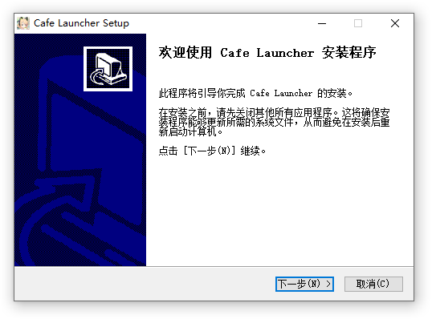
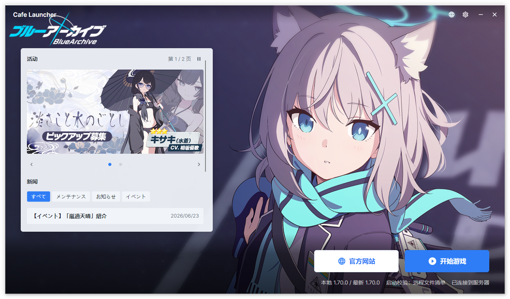
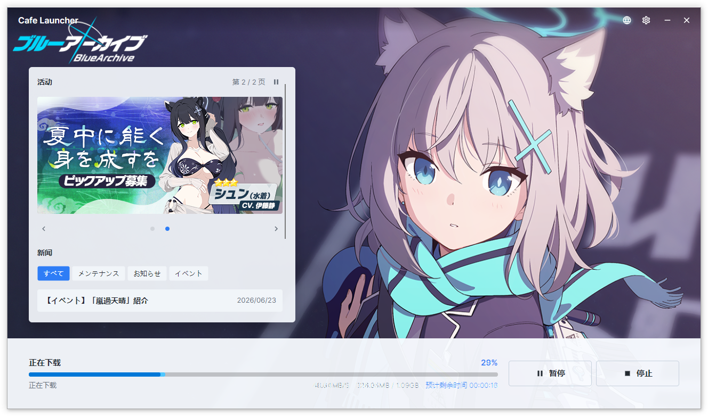

# 安装与首次使用

## 系统要求

| 项目 | 最低要求 |
|------|----------|
| 操作系统 | Windows 10 1809+ / Windows 11 |
| 架构 | x64（64 位） |
| 内存 | 4 GB |
| 磁盘空间 | 启动器 ~60 MB，游戏本体 ~10 GB+ |
| 网络 | 宽带连接 |
| 运行库 | 无需额外安装（自包含发布） |

## 下载

从 [GitHub Releases](https://github.com/bluearchive-cafe/Cafe.Launcher.Avalonia_Release/releases) 获取最新版本。每个版本提供两种格式：

| 格式 | 文件名 | 说明 |
|------|--------|------|
| 安装版（推荐） | `Cafe.Launcher.Avalonia_v*_setup.exe` | 带安装向导，自动创建快捷方式和卸载入口 |
| 便携版 | `Cafe.Launcher.Avalonia_v*_standalone.zip` | 解压即用，不写入注册表 |

## 安装版步骤

1. 下载 `setup.exe` 文件
2. 双击运行，如出现 UAC 提示请选择"是"
3. 选择安装语言（English / 简体中文 / 日本語）
4. 确认或修改安装路径（默认 `C:\Program Files\Cafe Launcher`）
5. （可选）勾选"创建桌面快捷方式"
6. 点击安装，等待完成

## 便携版步骤

1. 下载 `standalone.zip`
2. 解压到任意目录（建议不含中文路径）
3. 双击 `Cafe.Launcher.Avalonia.exe` 运行

## 界面概览

启动后你会看到主窗口，分为几个区域：

1. **标题栏** — 产品名、版本号，最小化和关闭按钮
2. **远程内容区**（左侧） — 公告、Banner、社交链接
3. **背景墙纸** — 可自定义的壁纸背景
4. **底部控制栏** — 游戏安装/启动按钮、进度显示
5. **状态信息** — 游戏路径、运行状态

## 首次安装游戏

1. 启动器会自动检测游戏是否已安装
2. 如未安装，底部会显示**安装**按钮
3. 点击安装，选择或确认游戏安装路径（默认在启动器同目录下 `YostarGames\BlueArchive_JP`）
4. 启动器开始下载游戏文件，支持断点续传和暂停/恢复

5. 下载完成后自动校验文件完整性
6. 校验通过后，按钮变为**启动游戏**

> **提示**：如果之前安装过官方启动器的游戏文件，将游戏路径指向同一目录即可复用已有文件，无需重新下载。
