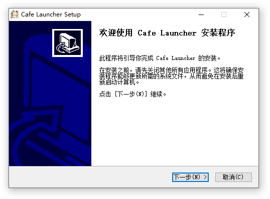
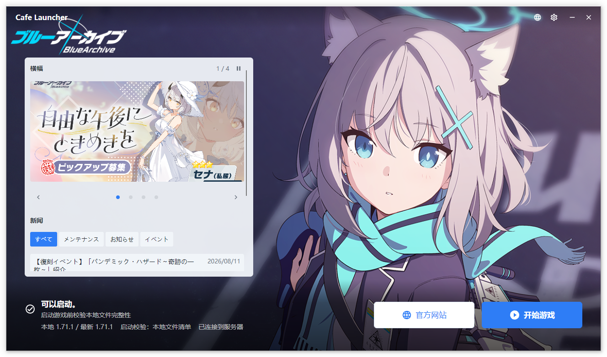
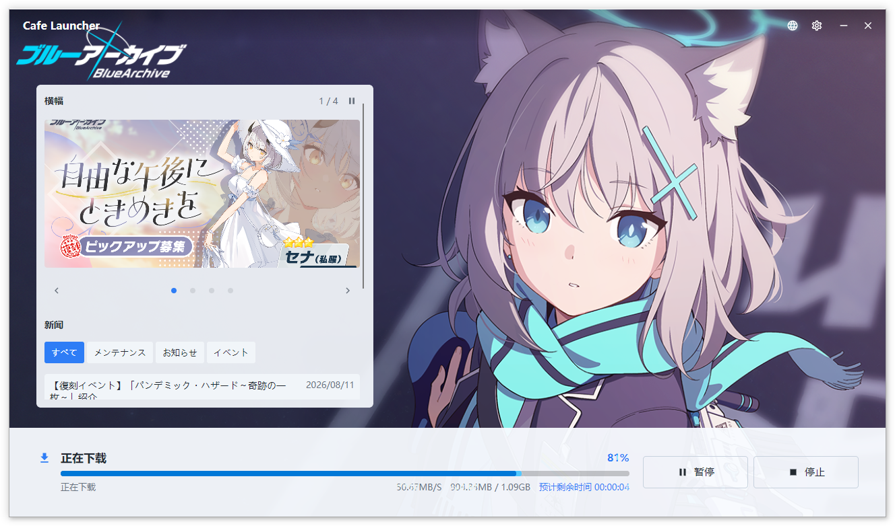

# 安装与首次使用

## 1. 确认平台

| 平台 | 可用发行包 | 支持状态 |
| --- | --- | --- |
| Windows 10 1809+ / Windows 11 x64 | 安装程序、便携 ZIP | 正式支持 |
| macOS Apple Silicon | `.app` 压缩包 | 实验性 |
| Linux x64 | `.deb`、AppImage、`tar.gz` | 实验性 |

发行包为自包含应用，无需另行安装 .NET Runtime。游戏本体仍需要足够的磁盘空间和持续可用的网络连接。

> [!WARNING]
> macOS 与 Linux 版本仍为实验性构建。Linux 下使用 UMU / Proton 或 Wine 启动 Windows 游戏客户端时，XIGNCODE3 反作弊兼容性未经验证。

## 2. 下载正确的文件

前往 [Cafe Launcher Releases](https://github.com/bluearchive-cafe/Cafe.Launcher.Avalonia_Release/releases)，进入最新版本并选择：

| 文件名 | 用途 |
| --- | --- |
| `Cafe.Launcher.Avalonia_v*_setup.exe` | Windows 标准安装，推荐大多数用户使用 |
| `Cafe.Launcher.Avalonia_v*_win-x64.zip` | Windows 便携版 |
| `Cafe.Launcher.Avalonia_v*_osx-arm64.zip` | Apple Silicon Mac |
| `Cafe.Launcher.Avalonia_v*_linux-x64.deb` | Debian、Ubuntu 等发行版 |
| `Cafe.Launcher.Avalonia_v*_linux-x64.AppImage` | Linux 免安装运行 |
| `Cafe.Launcher.Avalonia_v*_linux-x64.tar.gz` | Linux 手动解压部署 |

带有 `beta` 的版本属于测试频道。希望获得更稳定体验时，请选择不带预发布标签的最新版本。

## 3. 安装启动器

### Windows 安装版

1. 运行 `setup.exe`。
2. 接受系统的管理员权限提示。
3. 确认安装目录和快捷方式选项。
4. 安装完成后启动 Cafe Launcher。

默认安装目录是 `C:\Program Files\Cafe Launcher`。安装、升级和卸载按所有用户范围执行，需要管理员权限。

### Windows 便携版

1. 完整解压 `win-x64.zip`。
2. 运行 `Cafe.Launcher.Avalonia.exe`。
3. 更新时先退出程序，再替换便携目录。

不要直接在压缩包预览窗口中运行程序。便携版不会创建标准卸载入口，但设置和日志仍保存在用户数据目录中。

### macOS

解压 `osx-arm64.zip`，将 `Cafe Launcher.app` 移入“应用程序”后运行。该构建仅适用于 Apple Silicon Mac。

### Linux

- `.deb`：通过发行版的软件包管理工具安装。
- AppImage：赋予执行权限后直接运行。
- `tar.gz`：解压后运行 `Cafe.Launcher.Avalonia`。

Linux 系统需要提供图形、字体和基础运行库。若程序无法启动，请从终端运行并根据缺失库提示安装依赖。

## 4. 完成首次设置

第一次启动时会显示五步向导：

1. **语言**：选择启动器界面语言。
2. **下载源**：官方源提供原始资源；Cafe 源提供社区 CDN 与本地化资源。
3. **游戏路径**：选择一个基础目录，启动器会规范化为 `YostarGames/BlueArchive_JP`。
4. **代理**：选择自动、直连或系统代理。
5. **复核**：确认设置，或返回已完成步骤修改。

中文系统默认选择 Cafe 源，其他语言环境默认选择官方源。稳定构建默认跟踪稳定频道，预发布构建默认跟踪测试频道；两项设置之后都可以修改。

按 `Esc` 或选择跳过时，启动器会先要求确认，再应用默认设置。

## 5. 识别或安装游戏

- 如果已有官方启动器下载的游戏，选择其 `BlueArchive_JP` 目录。启动器会读取 `manifest.json` 和 `game-launcher-config.json`，无需重复下载完整游戏。
- 如果未安装游戏，点击主界面的“安装”。下载期间可以暂停或继续，完成后会自动校验。
- 如果目录中只有部分文件，启动器会根据清单计算并下载缺失内容。

> [!TIP]
> 安装前请确认目录可写，并预留足够空间。不要把游戏安装到只读目录；Linux 软件包和 AppImage 默认会改用用户主目录下的 `YostarGames/BlueArchive_JP`。

下一步可阅读[设置参考](/cafe-launcher/settings)或[游戏操作](/cafe-launcher/operations)。
