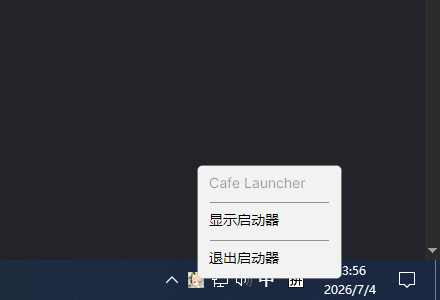

# 游戏操作

## 安装 / 更新

当检测到新版本时，启动器会自动计算需要下载的文件列表（仅下载变更文件），支持：

- **断点续传** — 下载中断后重新打开可继续
- **暂停 / 恢复** — 随时暂停下载，稍后恢复
- **速度限制** — 在设置中调整下载速度
- **CRC64 校验** — 下载完成后自动校验文件完整性
- **CDN 故障切换** — 主线路不可用时自动切换备用线路

## 修复

如果游戏文件损坏或缺失：

1. 确保游戏处于"可启动"状态
2. 点击**修复**按钮
3. 启动器对比本地文件与远程清单，重新下载不匹配的文件
4. 最多自动重试 3 次

## 卸载游戏

1. 在设置中将关闭行为切换为"直接退出"（避免最小化到托盘）
2. 关闭启动器
3. 手动删除游戏目录（默认位于启动器目录下的 `YostarGames\BlueArchive_JP`）

启动器**不会**管理游戏卸载流程，仅负责文件下载和更新。

## 系统托盘

当关闭行为设为"最小化到托盘"时（默认）：

- 点击窗口关闭按钮 → 最小化到系统托盘
- 右键托盘图标 → 打开窗口 / 退出启动器
- 再次双击桌面快捷方式 → 恢复窗口

