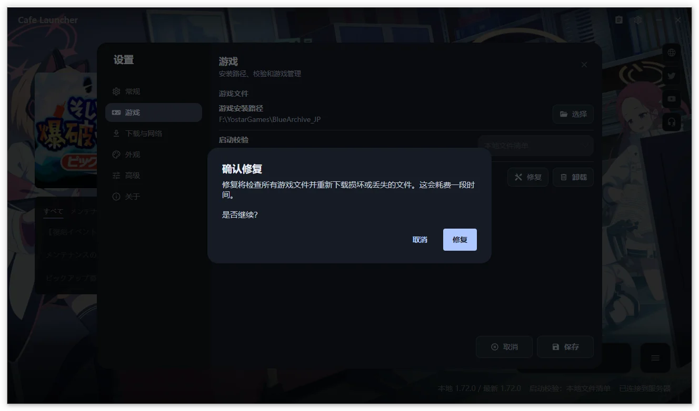
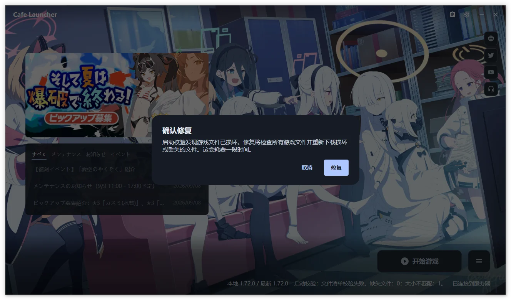
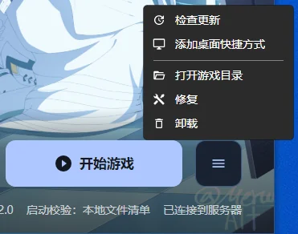
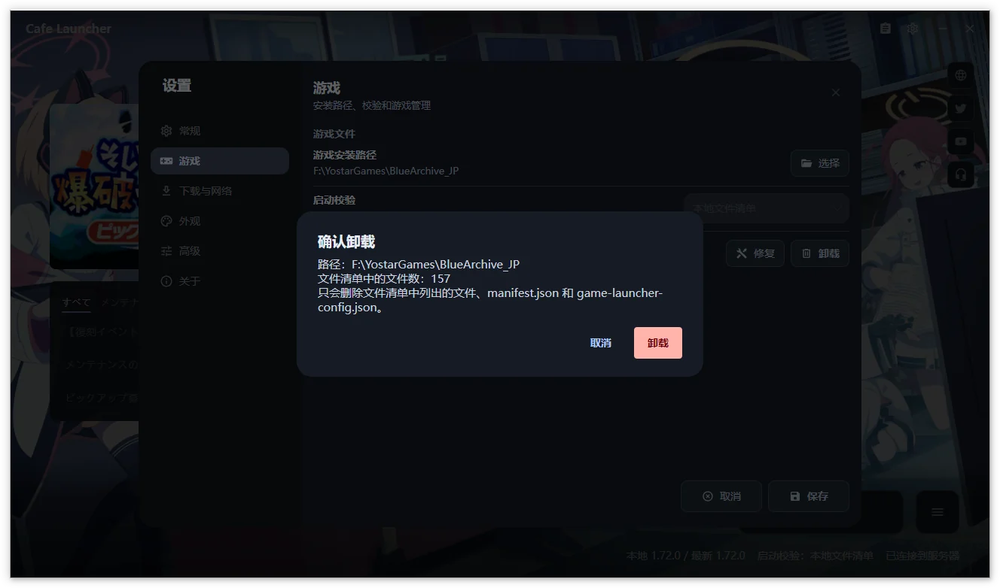
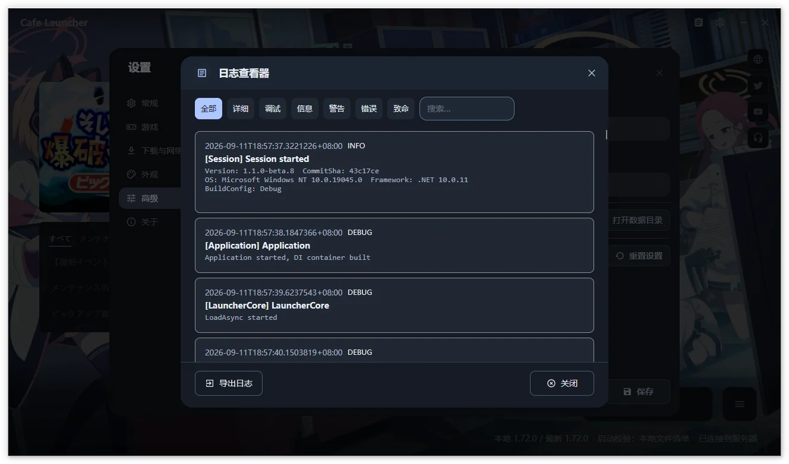

# 游戏操作

主界面会根据本地文件和远端版本显示“安装游戏”“更新游戏”或“开始游戏”。游戏操作进行时，底部区域会切换为进度与控制按钮。

## 安装与更新

1. 点击“安装游戏”或“更新游戏”。
2. 启动器读取远程清单并计算需要下载的文件。
3. 文件先写入 `.tmp` 临时文件；服务器支持时可从已有进度继续。
4. 下载完成后进行 CRC64 校验。
5. 全部文件通过校验后，启动器更新本地清单和游戏配置。

底部区域在下载期间会切换为进度视图，显示已完成百分比、当前速度、已下载与总大小，以及预计剩余时间；状态区同时显示当前使用的下载源（“下载源：Cafe”或“下载源：官方”）。

下载过程中可以：

- **暂停**：保留当前进度，之后继续。
- **继续**：从已保存的临时文件恢复。
- **停止**：取消当前操作，确认后会放弃这次下载任务状态。
- **限速**：在“设置 → 下载与网络”调整速度上限。

只有当游戏版本、清单、目录和下载源与保存的任务一致时，启动器才会在下次启动时恢复进度，避免把旧任务错误应用到另一套文件。

## 修复

遇到缺失文件、资源异常或反复启动失败时：

1. 关闭正在运行的游戏。
2. 打开“设置 → 游戏”，或使用[游戏操作菜单](#游戏操作菜单)中的“修复”。
3. 点击“修复”并确认。

   

4. 等待启动器对照远程清单检查文件。
5. 缺失或校验不一致的文件会被重新下载。

修复执行 CRC64 完整性检查，比启动前的大小检查更完整。流程结束后会再次确认安装状态；若仍失败，请切换下载源后重试，或按[反馈指南](/cafe-launcher/feedback)导出日志。安装、修复、更新等操作失败弹出的提示条上直接带有“查看日志”动作，点击即可跳到日志入口，不必先去设置里查找。

切换下载源后启动器会主动提示执行一次修复：Cafe 源与官方源使用不同的文件清单，只有按当前线路修复过，启动校验的结果才可靠。

## 启动游戏

点击“开始游戏”后，启动器按所选模式验证文件，然后启动清单指定的游戏入口。默认情况下，游戏成功启动后，启动器会最小化到系统托盘。

控制面板与托盘菜单会显示当前会话状态：启动过程显示“游戏启动中”，游戏进程出现后变为“游戏运行中”，游戏结束后换成“游戏已退出（退出码 X）”。没有会话时状态行整行隐藏，正常退出只会替换状态行，不会额外打扰。

如果使用第三方运行器（Wine / Proton）启动，而运行器在游戏进程出现之前就退出（例如前缀损坏、缺少依赖），启动器会先把主窗口从托盘恢复出来，再提示“游戏未能启动（退出码 X）”。

如果启动校验发现文件损坏，启动器会在启动前给出修复提示，状态面板同时显示具体的缺失与不匹配数量：

Linux 会根据“设置 → 游戏 → 运行环境”选择自动、Windows（原生）、UMU / Proton 或 Wine。此能力为实验性，反作弊是否可用取决于运行环境。

macOS 暂不支持启动游戏：该平台缺少兼容运行层，也暂无支持计划；macOS 版本仍可用于安装、更新和修复游戏。

## 游戏操作菜单

主界面游戏卡片旁的下拉按钮打开游戏操作菜单：

- **检查更新**：重新读取远端版本并刷新主按钮状态。
- **添加桌面快捷方式**：为游戏创建快捷方式，目前仅支持 Windows。
- **打开游戏目录**：在系统文件管理器中打开当前目录。
- **修复**：执行上一节描述的完整性检查。
- **卸载**：删除启动器管理的游戏文件，见下一节。

## 卸载游戏

1. 关闭游戏。
2. 打开“设置 → 游戏”，或使用游戏操作菜单中的“卸载”。
3. 在确认对话框中核对路径和文件数量。

   

4. 确认后，启动器默认只删除清单跟踪的游戏文件和安装状态，即清单中列出的文件、`manifest.json` 和 `game-launcher-config.json`。确认对话框中另有“彻底清除”选项，勾选后会连同整个安装目录和启动器管理的兼容环境一起删除；位于安装目录之外的自定义兼容环境（Prefix）任何情况下都会保留。

> [!IMPORTANT]
> 游戏卸载与启动器卸载是两件不同的事。默认的游戏卸载不会删除未被清单管理的自有文件；启动器卸载则默认保留整个游戏目录。

## 日志查看器

“设置 → 高级 → 查看日志”打开日志查看器。它按级别分页展示当前会话与轮转日志，支持关键字搜索。

日志查看器分批加载记录，搜索和级别筛选只作用于已经加载的内容；排查偶发问题时，可以先在“设置 → 高级”临时提高日志级别，复现后立即导出日志。

## 系统托盘

关闭行为设置为“最小化到托盘”时：

- 点击关闭按钮会隐藏主窗口，而不是退出进程。
- 右键托盘图标可以直接“开始游戏”或打开“设置”，不必先打开主窗口；游戏启动中或运行中时，“开始游戏”一项会显示当前会话状态。需要确认框或提示时，这两个入口会先把主窗口恢复出来。
- 从托盘菜单也可以重新显示主窗口或彻底退出。

  

- 再次启动 Cafe Launcher 会唤醒已有实例，不会并行打开第二个实例（Linux 上按登录会话识别）。
