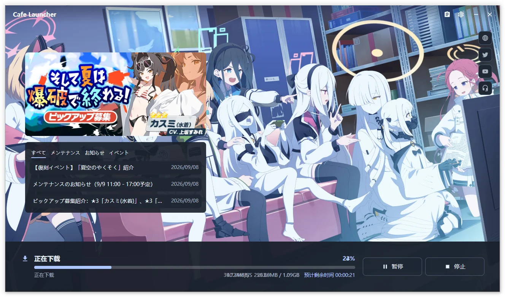
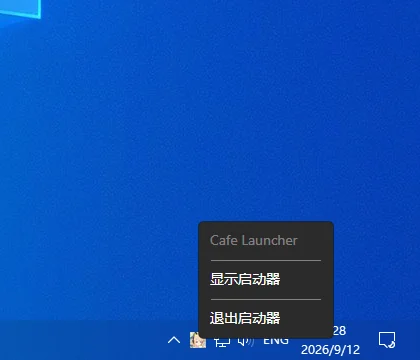

# 游戏操作

主界面会根据本地文件和远端版本显示“安装”“更新”或“启动”。游戏操作进行时，底部区域会切换为进度与控制按钮。

## 安装与更新

1. 点击“安装”或“更新”。
2. 启动器读取远程清单并计算需要下载的文件。
3. 文件先写入 `.tmp` 临时文件；服务器支持时可从已有进度继续。
4. 下载完成后进行 CRC64 校验。
5. 全部文件通过校验后，启动器更新本地清单和游戏配置。

下载过程中可以：

- **暂停**：保留当前进度，之后继续。
- **继续**：从已保存的临时文件恢复。
- **停止**：取消当前操作；确认后会放弃这次下载任务状态。
- **限速**：在“设置 → 下载与网络”调整速度上限。

只有当游戏版本、清单、目录和下载源与保存的任务一致时，启动器才会在下次启动时恢复进度，避免把旧任务错误应用到另一套文件。

## 修复

遇到缺失文件、资源异常或反复启动失败时：

1. 关闭正在运行的游戏。
2. 打开“设置 → 游戏”。
3. 点击“修复”并确认。
4. 等待启动器对照远程清单检查文件。
5. 缺失或校验不一致的文件会被重新下载。

修复执行 CRC64 完整性检查，比启动前的大小检查更完整。流程结束后会再次确认安装状态；若仍失败，请切换下载源后重试，或按[反馈指南](/cafe-launcher/feedback)导出日志。

## 启动游戏

点击“启动”后，启动器按所选模式验证文件，然后启动清单指定的游戏入口。默认情况下，游戏成功启动后，启动器会最小化到系统托盘。

Linux 会根据“设置 → 游戏 → 兼容运行时”选择自动、原生、UMU / Proton 或 Wine。此能力为实验性，反作弊是否可用取决于运行环境。

## 游戏操作菜单

主界面的游戏操作菜单提供：

- **检查更新**：重新读取远端版本并刷新主按钮状态。
- **打开游戏目录**：在系统文件管理器中打开当前目录。
- **创建桌面快捷方式**：为游戏创建快捷方式，目前仅支持 Windows。

## 卸载游戏

1. 关闭游戏。
2. 打开“设置 → 游戏”。
3. 点击“卸载”并检查确认对话框中的路径和文件数量。
4. 确认后，启动器删除清单跟踪的游戏文件和安装状态。

> [!IMPORTANT]
> 游戏卸载与启动器卸载是两件不同的事。游戏卸载不会删除未被清单管理的自有文件；启动器卸载则默认保留整个游戏目录。

## 系统托盘

关闭行为设置为“最小化到托盘”时：

- 点击关闭按钮会隐藏主窗口，而不是退出进程。
- 从托盘菜单可以重新显示窗口或彻底退出。
- 再次启动 Cafe Launcher 会唤醒已有实例，不会并行打开第二个实例。

