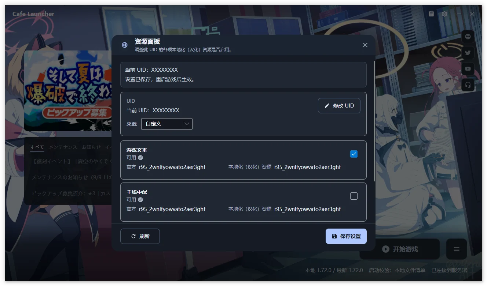

# 资源面板

资源面板用于按 UID 管理蔚蓝咖啡厅提供的汉化资源。点击主窗口标题栏的“资源面板”按钮（齿轮左侧的剪贴板图标）打开。

> [!IMPORTANT]
> 资源面板由 Cafe 下载源提供。当前使用官方下载源时，打开面板会提示切换；切换下载源后，已安装的游戏需要按新下载源执行一次修复，参见[游戏操作](/cafe-launcher/operations#修复)。

## UID

汉化资源按账号 UID 匹配，因此面板需要一个准确的 UID：

| 来源 | 行为 |
| --- | --- |
| 自动获取 | 从游戏目录下的 Cookie 文件中读取当前登录账号的 UID，默认选项；Linux 上会到配置的兼容前缀（UMU 或 Wine）中读取 |
| 自定义 | 手动填写 UID，适合账号未在本机登录的情况 |

选择“自定义”后会出现“修改 UID”按钮。UID 必须是八位大写字母（A-Z），例如 `ABCDEFGH`。如果启动器无法从 Cookie 文件读取到 UID，面板会直接显示输入框，填写后点击“保存 UID”即可。

UID 尚未生成时，面板会常驻显示一条说明：“通过 Cafe 下载源首次启动游戏后，才会生成 UID。”

## 资源类别

| 类别 | 内容 |
| --- | --- |
| 游戏文本 | 剧情、界面和道具等文本资源 |
| 主线中配 | 主线剧情的中文配音资源 |
| 图像视频 | 图像与视频资源 |

每个类别显示自身的开关、状态，以及官方与汉化资源各自的版本标识：

| 状态 | 含义 |
| --- | --- |
| 可用 | 汉化资源的版本与官方一致，可以正常启用 |
| 待维护 | 汉化资源的版本与官方不一致，通常表示尚未跟上本次游戏更新；仍然可以勾选 |
| 加载中 / 获取失败 | 正在读取，或读取失败；可以用“刷新”重试 |

## 保存与生效

- **刷新**：重新从服务器读取各类资源的最新状态和版本。
- **保存设置**：把当前开关写入游戏资源目录，重启游戏后生效。

面板顶部的状态条会显示当前 UID 和最近一次操作的结果。只想使用原始日服资源时，取消勾选对应类别并保存即可。
