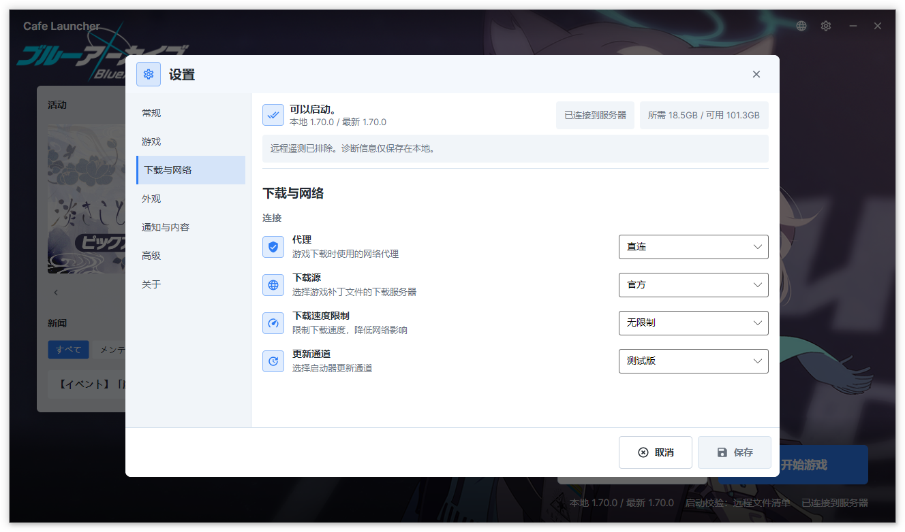

# 设置

点击标题栏的齿轮图标进入设置页面。设置按类别分为 5 个标签页：

## 通用（General）

| 设置项 | 选项 | 默认值 | 说明 |
|--------|------|--------|------|
| 语言 | 自动 / English / 简体中文 / 繁體中文 / 日本語 | 自动 | 界面显示语言，"自动"跟随系统 |
| 关闭行为 | 最小化到托盘 / 直接退出 | 最小化到托盘 | 点击关闭按钮的行为 |
| 动态效果 | 跟随系统 / 完整 / 减少 | 跟随系统 | 控制动画和轮播自动播放 |

## 游戏（Game）

| 设置项 | 选项 | 默认值 | 说明 |
|--------|------|--------|------|
| 游戏路径 | 自定义目录 | 未设置（首次向导选择） | 游戏安装位置，保存时规范化为以 `YostarGames\BlueArchive_JP` 结尾的绝对路径 |
| 启动检查 | 本地清单 / 远程清单 / 不检查 | 本地清单 | 启动前验证游戏文件的方式 |

### 启动检查模式说明

启动检查决定点击"启动游戏"时如何验证游戏文件：

| 模式 | 验证方式 | 适用场景 |
|------|----------|----------|
| 本地清单 | 对比本地文件与本地 `manifest.json` 的**文件大小** | 默认选项，启动最快 |
| 远程清单 | 从服务器获取清单后对比**文件大小** | 本地清单可能损坏时使用。若无法获取远程清单，**允许启动**（避免卡死） |
| 不检查 | 跳过所有验证，直接启动 | 确认文件正常但验证流程异常时使用 |

> **提示**：启动检查仅验证**文件大小**，修复操作才会执行 **CRC64 完整校验**。如果怀疑文件损坏，请使用"修复"而非切换启动检查模式。

## 下载与网络（Download & Network）

| 设置项 | 选项 | 默认值 | 说明 |
|--------|------|--------|------|
| 下载速度限制 | 不限速 / 1 MB/s / 5 MB/s / 10 MB/s / 25 MB/s / 50 MB/s | 不限速 | 限制游戏文件下载速度 |
| CDN 线路 | 官方 / Cafe | 官方 | 游戏文件下载线路 |
| 代理设置 | 自动 / 直连 / 使用系统代理 | 自动 | 网络代理方式 |
| 更新通道 | 稳定版 / 测试版 | 稳定版 | 启动器自身更新渠道 |
| 日志级别 | Verbose / Debug / Information / Warning / Error / Fatal | Information | 诊断日志详细程度 |

### 代理设置说明

**直连**：启动器直接连接网络，不使用任何代理。适合无需代理即可正常访问游戏服务器的网络环境。

**使用系统代理**：启动器使用 Windows 系统代理设置（"设置 → 网络和 Internet → 代理"）。适合使用了代理软件（如 Clash、v2rayN 等）且开启了系统代理的用户。

> **Clash Verge / TUN 模式用户**：如果你使用 Clash 的 TUN 模式（虚拟网卡），代理设置保持"直连"即可——TUN 模式下所有流量自动经过代理，无需额外配置。

## 外观（Appearance）

| 设置项 | 选项 | 默认值 | 说明 |
|--------|------|--------|------|
| 背景来源 | 内置 / 远程 / 自定义 | 内置 | 启动器背景壁纸 |
| 壁纸填充方式 | 填充 / 等比缩放 / 裁剪填充 | 裁剪填充 | 壁纸缩放策略 |
| 壁纸底色 | 颜色选择器 | 黑色 | 壁纸未覆盖区域的填充色 |
| 主题色模式 | 默认 / 跟随系统 / 取自壁纸 / 自定义 | 默认 | 按钮、进度条等高亮颜色 |
| 自定义主题色 | 颜色选择器 | #2E7DF6 | 当主题色模式设为"自定义"时启用 |
| 主题模式 | 跟随系统 / 浅色 / 深色 | 跟随系统 | 启动器配色方案 |
| Toast 通知 | 开 / 关 | 开 | 操作结果通知 |
| 远程内容卡片 | 开 / 关 | 开 | 主界面活动与新闻区域 |

## 关于（About）

显示启动器版本号、Git 提交记录、.NET 运行时版本、Avalonia 框架版本、构建配置（Debug/Release）。提供以下链接：

- [官方网站](https://bluearchive.cafe/)
- [GitHub 仓库](https://github.com/bluearchive-cafe/Cafe.Launcher.Avalonia_Release)
- [帮助文档](https://docs.bluearchive.cafe/cafe-launcher/)
- 检查更新
- 查看日志（首次加载最新 500 条，可继续加载更早记录）
- 导出日志、打开数据目录
- 版权说明
