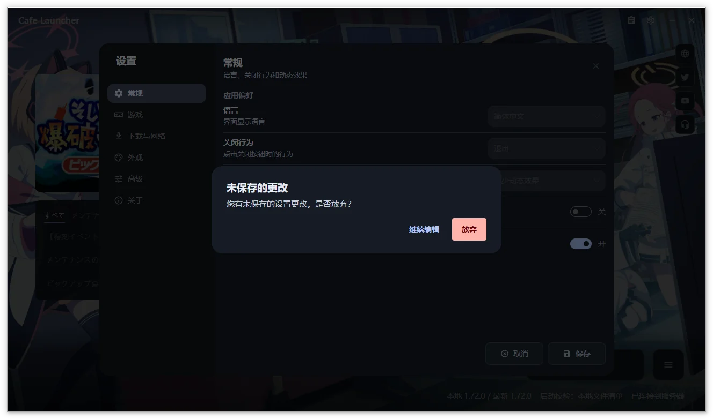
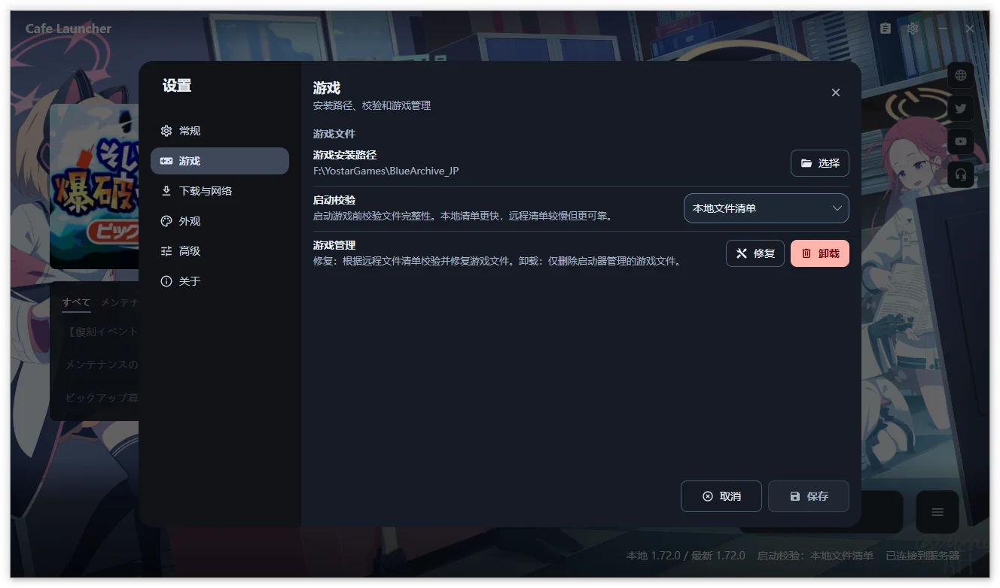
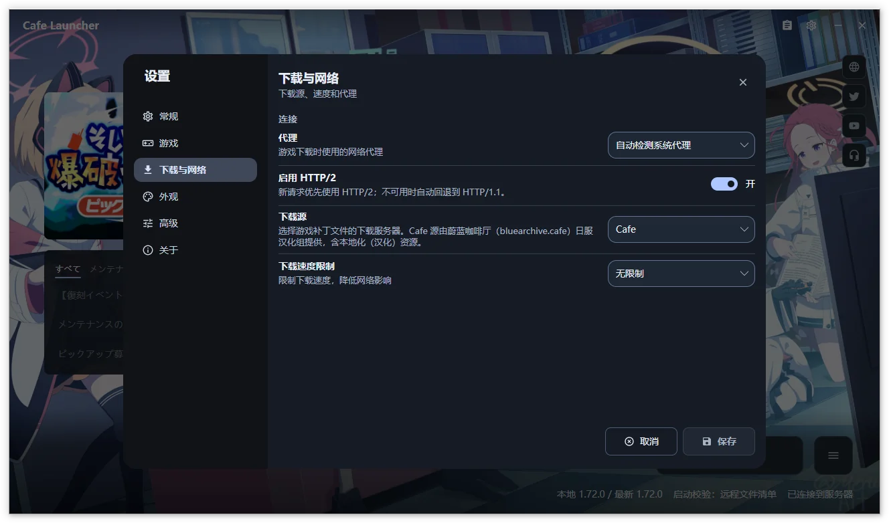
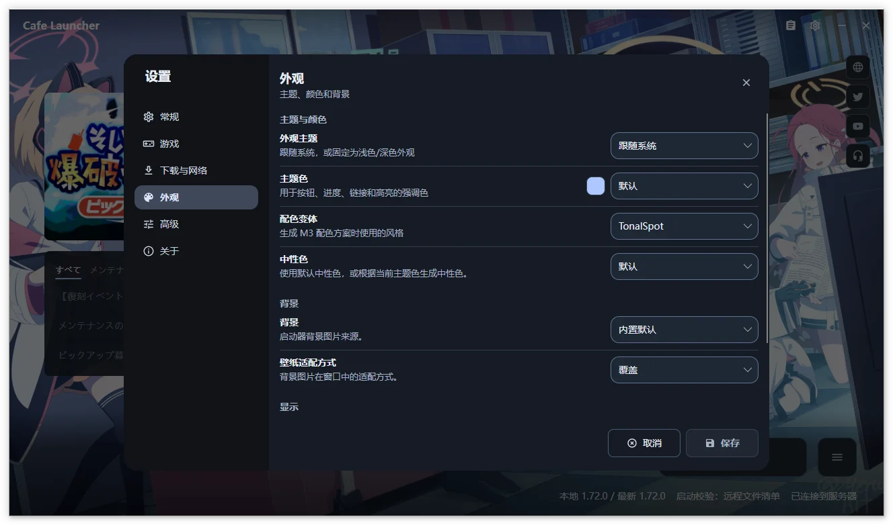
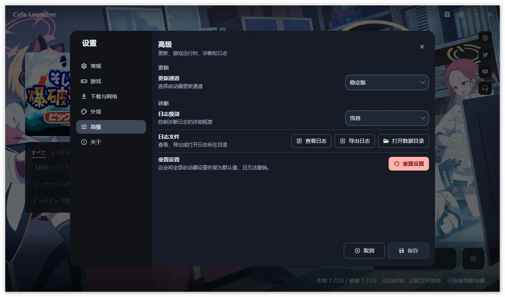
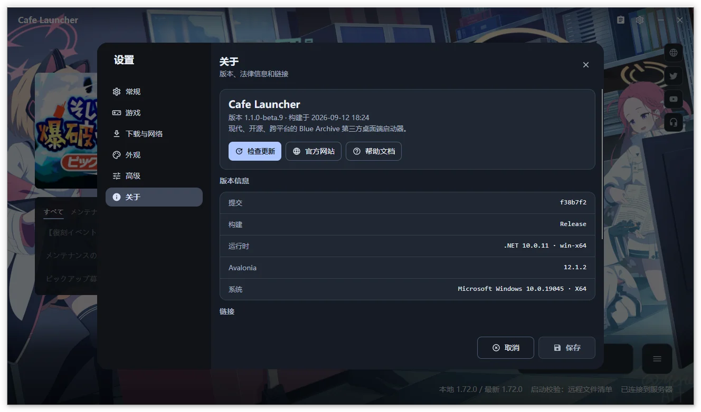

# 设置参考

点击主窗口右上角的齿轮打开设置。左侧依次是常规、游戏、下载与网络、外观、高级、关于六个分类。

除明确标注为即时生效的项以外，所有修改都是草稿，需要点击“保存”才会写入 `settings.json`。带着未保存的修改关闭设置时，启动器会先询问是否放弃。

## 常规

本页分为“应用偏好”“显示”和“更新”三个分组。

### 应用偏好

| 设置 | 可选值 | 说明 |
| --- | --- | --- |
| 语言 | 自动（跟随系统语言）、English、简体中文、繁體中文、日本語 | 界面显示语言 |
| 关闭行为 | 最小化到托盘、退出 | 点击关闭按钮时的行为 |
| 游戏启动后的行为 | 保持窗口打开、最小化到托盘、退出启动器 | 游戏成功启动后启动器的动作 |
| 动态效果 | 跟随系统、完整动态效果、减少动态效果 | 控制界面动画和轮播图自动播放 |
| 记忆窗口位置和大小 | 开、关 | 启动时恢复启动器窗口的位置和大小 |

### 显示

| 设置 | 可选值 | 说明 |
| --- | --- | --- |
| 状态面板 | 不显示、简略 | 控制底部状态区域的显示和详细程度 |
| 远程内容卡片 | 开、关 | 在主界面显示公告与横幅；加载失败时卡片上会就地提供“重试”按钮 |

### 更新

| 设置 | 可选值 | 说明 |
| --- | --- | --- |
| 启动时检查更新 | 开、关 | 初始化完成后在后台检查所选更新通道 |
| 更新通道 | 稳定版、测试版 | 决定启动器自身更新是否包含预发布版本 |

Toast 通知始终启用，没有单独开关；提示条按类型停留固定时长，鼠标悬停时会暂停计时。

## 游戏

| 设置 | 可选值 | 说明 |
| --- | --- | --- |
| 游戏安装路径 | 本地目录 | 最终规范化为以 `YostarGames/BlueArchive_JP` 结尾的绝对路径；路径旁的“打开游戏目录”可在文件管理器中打开该目录 |
| 启动校验 | 本地文件清单、远程文件清单、无 | 启动游戏前如何检查文件完整性 |
| 游戏管理 | 修复、卸载 | 修复：检查并修复损坏或缺失的游戏文件。卸载：默认只删除启动器管理的游戏文件，也可以选择彻底清除 |

> [!NOTE]
> 设置面板里的“选择”只修改草稿路径，点“保存”后才会写入。主窗口上的“更改路径”和“选择已安装游戏”是即时操作，会立即保存并刷新主界面状态。

### 启动校验模式

| 模式 | 行为 | 适用情况 |
| --- | --- | --- |
| 本地文件清单 | 使用本地 `manifest.json` 检查文件存在性与大小 | 默认模式，速度最快 |
| 远程文件清单 | 获取远程清单后检查文件存在性与大小 | 怀疑本地清单过期或损坏 |
| 无 | 直接尝试启动，状态面板显示“已禁用” | 临时绕过校验问题 |

启动校验不会替代完整修复。怀疑文件内容损坏时，应执行“修复”，由修复流程进行 CRC64 校验并重新下载不匹配文件。

### 兼容运行环境（仅 Linux）

| 设置 | 说明 |
| --- | --- |
| 运行环境 | 选择启动 Windows 游戏客户端的方式，可选自动、Windows（原生）、UMU / Proton（实验性）、Wine（实验性）；Linux 选项均为实验性，XIGNCODE3 反作弊兼容性未经验证 |
| 运行器路径 | 自定义 `umu-run` 或 `wine` 可执行文件，留空自动检测 |
| Prefix 路径 | 留空由 Cafe Launcher 按运行器管理相互隔离的 Prefix |
| Proton 路径 | 自定义 UMU 使用的 Proton 版本，留空由 UMU 自动选择 |
| 运行环境状态 | 只读，显示当前运行环境的检测结果（可用、无法运行、未找到等） |

启动游戏前，启动器还会检查兼容前缀所在的环境（例如前缀位置是否可写、挂载点是否禁用可执行、文件系统是否支持符号链接），有问题时会拦截启动并给出修改建议。

## 下载与网络

| 设置 | 可选值 | 说明 |
| --- | --- | --- |
| 代理 | 自动检测系统代理、直连（不使用代理）、系统代理（优先使用显式配置） | 游戏下载时使用的网络代理 |
| 启用 HTTP/2 | 开、关 | 新请求优先使用 HTTP/2；不可用时自动回退到 HTTP/1.1 |
| 下载源 | 官方、Cafe | 选择游戏补丁文件的下载服务器 |
| 下载速度限制 | 无限制、1、5、10、25、50 MB/s | 限制下载速度，降低网络影响 |

- **自动检测系统代理**：使用启动器默认网络行为。
- **直连（不使用代理）**：不使用显式代理。
- **系统代理（优先使用显式配置）**：优先使用系统中明确配置的代理；如未配置，则使用系统自动代理（Linux 上读取 GNOME 的系统代理设置）。

如果代理软件以 Fake-IP 模式接管 DNS，直连路径上落在保留段（IPv4 `198.18.0.0/15`、IPv6 `fc00::/7`）的解析结果不会被当作异常拦截；若随后仍然连接失败，提示会点明这一根因，并建议把代理切换到“自动检测系统代理”，或在代理软件中开启 TUN / 关闭 Fake-IP DNS。

切换下载源后，如果当前游戏已经可启动，启动器会提示按新线路执行一次修复，使本地文件与新清单保持一致。Cafe 源由蔚蓝咖啡厅（bluearchive.cafe）日服汉化组提供，还附带本地化资源和[资源面板](/cafe-launcher/resource-panel)能力。

## 外观

### 主题与颜色

| 设置 | 可选值 | 说明 |
| --- | --- | --- |
| 外观主题 | 跟随系统、浅色、深色 | 跟随系统，或固定为浅色/深色外观 |
| 主题色 | 默认、跟随系统、从壁纸获取、自定义 | 用于按钮、进度、链接和高亮的强调色 |
| 取色算法 | M3 Celebi + Score、Wu、Wsmeans、Octree（旧版） | 从壁纸提取种子色时使用的算法，仅在主题色为“从壁纸获取”时出现 |
| 配色变体 | TonalSpot、Vibrant、Expressive、Content、Fidelity、Neutral、Rainbow、Monochrome | 生成 M3 配色方案时使用的风格 |
| 中性色 | 默认、跟随主题色 | 使用默认中性色，或根据当前主题色生成中性色 |
| 壁纸色板 | 从当前背景图提取 | 选择壁纸中的颜色作为主题种子色，仅在主题色为“从壁纸获取”时出现 |

### 背景

| 设置 | 可选值 | 说明 |
| --- | --- | --- |
| 背景 | 内置默认、远程、自定义 | 启动器背景图片来源 |
| 壁纸适配方式 | 拉伸填充、适应、覆盖 | 背景图片在窗口中的适配方式 |
| 壁纸背景色 | 自定义颜色 | 使用“适应”模式时，壁纸周围的填充颜色 |
| 自定义背景 | 选择图片、选择文件夹、清除 | 选择本地图片或文件夹作为启动器背景，仅在背景为“自定义”时出现 |

内置背景取自 Pixiv 画师的作品，来源与授权说明可以在“关于”页查看。

## 高级

### 诊断

| 设置 | 可选值 | 说明 |
| --- | --- | --- |
| 日志级别 | 详细、调试、信息、警告、错误、致命 | 控制诊断日志的详细程度 |
| 日志文件 | 查看日志、导出日志、打开数据目录 | 查看、导出或打开日志所在目录 |

“查看日志”打开[日志查看器](/cafe-launcher/operations#日志查看器)，分批加载记录，搜索和级别筛选只作用于已经加载的内容。“导出日志”打开[导出诊断信息](/cafe-launcher/feedback#导出日志)对话框。排查偶发问题时，可以临时提高日志级别，复现后立即导出日志。

### 重置设置

“重置设置”会把全部启动器设置恢复为默认值，且无法撤销。该操作立即生效，不需要点击“保存”。执行前建议先导出日志，以便需要时回溯此前的配置。

## 关于

“关于”页显示版本信息——提交、构建、.NET 运行时、Avalonia 与系统平台，并提供三个快捷入口：

- **检查更新**：使用已经保存的更新通道与代理设置手动检查。
- **官方网站**：打开项目官网。
- **帮助文档**：打开本页所在的文档站。

下方的“链接”区收录了 GitHub 仓库、GitHub 发布仓库和问题反馈；“法律信息”区另行提供隐私政策、内置背景的原始作品来源与免责声明。

手动检查更新发现新版本后，Windows 上会在“发现新版本”对话框中先预览该版本的发布说明：点“下载”即可在启动器内完成下载并显示进度，更新包会先按发布页的 SHA-256 摘要清单校验，校验通过后点“重启以更新”退出、自动安装并重新打开，全程不需要手动下载或运行安装程序。发布会缺少摘要清单或本机所需的安装包时，启动器改为打开发布页，绝不执行未经校验的文件。

macOS 与 Linux 不支持应用内更新，对话框的主按钮是“前往发布页”，点击后用浏览器打开发布页，下载与安装由你手动完成。
