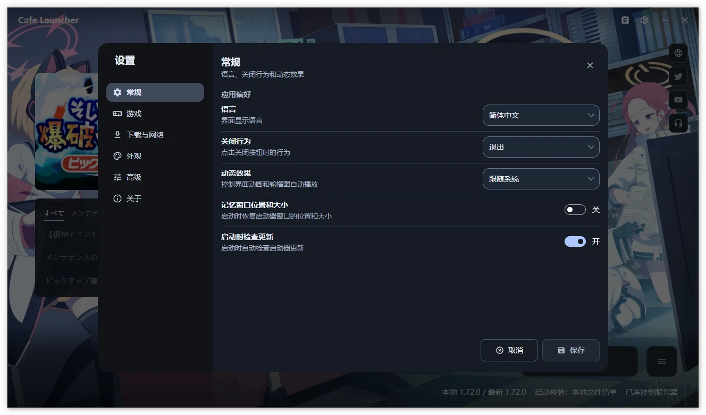

# 设置参考

点击主窗口右上角的齿轮打开设置。大多数修改只有在点击“保存”后才会写入 `settings.json`；取消或直接关闭设置会放弃未保存的修改。

> [!NOTE]
> “更改游戏路径”和“检测已安装游戏”属于即时操作，会立即保存路径并刷新主界面状态。

## 常规

| 设置 | 可选值 | 说明 |
| --- | --- | --- |
| 语言 | 自动、English、简体中文、繁體中文、日本語 | 自动模式跟随系统界面语言 |
| 关闭行为 | 最小化到托盘、直接退出 | 控制点击窗口关闭按钮后的行为 |
| 动态效果 | 跟随系统、完整、减少 | 控制 Toast、对话框和 Banner 等动画 |
| 记住窗口位置和大小 | 开、关 | 下次启动时恢复正常窗口的位置与尺寸 |
| 启动时检查更新 | 开、关 | 初始化完成后在后台检查所选频道 |

Toast 通知始终启用，没有单独开关。

## 游戏

| 设置 | 可选值 | 说明 |
| --- | --- | --- |
| 游戏路径 | 本地目录 | 最终规范化为以 `YostarGames/BlueArchive_JP` 结尾的绝对路径 |
| 启动验证 | 本地清单、远程清单、不检查 | 决定启动游戏前如何检查文件 |
| 游戏管理 | 修复、卸载 | 修复损坏文件，或按清单删除游戏 |
| 兼容运行时（仅 Linux） | 自动、原生、UMU / Proton、Wine | 实验性启动方式，反作弊兼容性未经验证 |

### 启动验证模式

| 模式 | 行为 | 适用情况 |
| --- | --- | --- |
| 本地清单 | 使用本地 `manifest.json` 检查文件存在性与大小 | 默认模式，速度最快 |
| 远程清单 | 获取远程清单后检查文件存在性与大小 | 怀疑本地清单过期或损坏 |
| 不检查 | 直接尝试启动 | 临时绕过验证问题 |

启动验证不会替代完整修复。怀疑文件内容损坏时，应执行“修复”，由修复流程进行 CRC64 校验并重新下载不匹配文件。

## 下载与网络

| 设置 | 可选值 | 说明 |
| --- | --- | --- |
| 代理 | 自动、直连、系统代理 | 控制 API 与游戏文件请求的代理行为 |
| 下载源 | 官方、Cafe | 决定游戏文件和资源来自哪条线路 |
| 下载限速 | 不限速、1、5、10、25、50 MB/s | 降低下载对其他网络活动的影响 |
| 更新频道 | 稳定版、测试版 | 决定启动器自身更新是否包含预发布版本 |

- **自动**：使用启动器默认网络行为。
- **直连**：不使用显式代理。
- **系统代理**：优先使用系统中明确配置的代理，没有时使用系统自动检测结果。

切换下载源后，如果当前游戏已经可启动，启动器可能提示执行修复，使本地文件与新线路保持一致。Cafe 源还提供本地化资源和资源面板能力。

## 外观

| 设置 | 可选值 | 说明 |
| --- | --- | --- |
| 主题 | 跟随系统、浅色、深色 | 控制界面明暗模式 |
| 主题色 | 默认、系统、壁纸、自定义 | 控制按钮、进度和链接等强调色 |
| 壁纸色板 | 从当前背景提取 | 选择壁纸中的颜色作为主题种子色 |
| 取色算法 | Celebi + Score、Wu、Wsmeans、Octree | 控制壁纸颜色提取方法 |
| 配色变体 | Tonal Spot、Vibrant、Expressive 等 | 控制 Material 3 调色风格 |
| 中性色 | 品牌蓝、跟随种子色 | 控制界面中性色的色相来源 |
| 背景来源 | 内置、远程、自定义 | 自定义模式可以选择图片或图片文件夹 |
| 填充方式 | 拉伸、等比适应、裁剪填充 | 控制背景如何适配窗口 |
| 背景底色 | 自定义颜色 | 等比适应时填充未覆盖区域 |
| 状态面板 | 隐藏、简略 | 控制底部状态信息 |
| 远程内容卡片 | 开、关 | 控制公告、Banner、新闻和社交内容区域 |

选择一个图片文件夹作为自定义背景时，启动器会从支持的图片中选择背景。主题色取自壁纸时，可以重新提取色板并选择种子色。

## 高级

| 设置 | 可选值 | 说明 |
| --- | --- | --- |
| 日志级别 | Verbose、Debug、Information、Warning、Error、Fatal | 控制写入日志的最低级别 |
| 查看日志 | — | 打开内置日志查看器 |
| 导出日志 | — | 生成包含日志和系统信息的 ZIP |
| 打开数据目录 | — | 打开启动器用户数据目录 |

日志查看器分批加载记录，搜索和级别筛选只作用于已经加载的内容。排查偶发问题时，可以临时提高日志级别，复现后立即导出日志。

## 关于

“关于”页显示版本、构建时间、Git 提交、.NET、Avalonia 和平台信息，并提供检查更新、官网、源码、文档、隐私说明和第三方许可入口。

手动检查更新使用已经保存的更新频道与代理设置。发现新版本后，选择与当前平台匹配的文件，启动器会打开浏览器进行下载。
