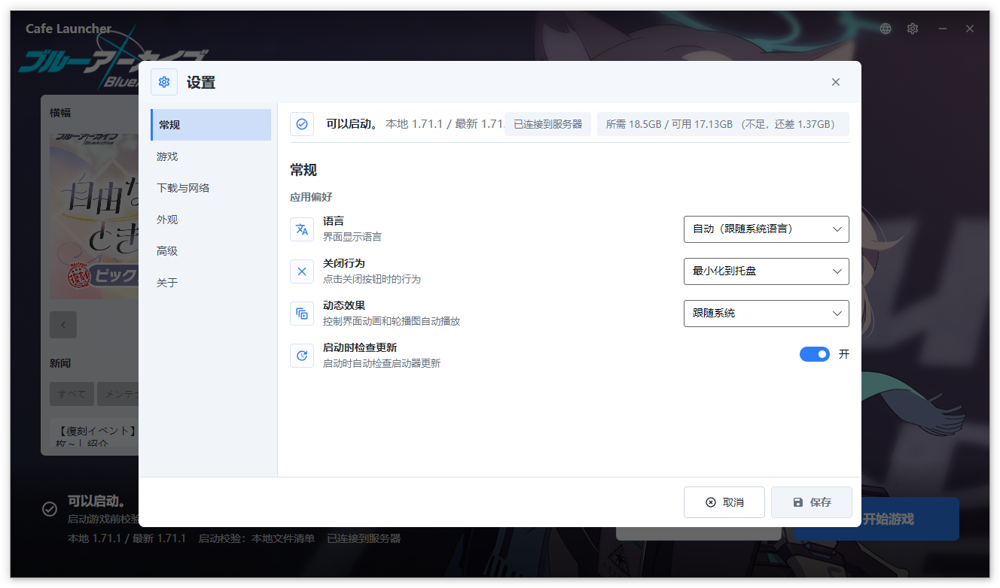

# 设置

点击标题栏的齿轮图标进入设置。当前设置面板分为 6 个分类；面板内的修改需要点击“保存”才会持久化，关闭或取消会放弃未保存的改动。主界面的“更改路径”和“检测已安装游戏”属于即时操作，会直接保存并刷新状态。

## 常规（General）

| 设置项 | 选项 | 默认值 | 说明 |
|--------|------|--------|------|
| 语言 | 自动 / English / 简体中文 / 繁體中文 / 日本語 | 自动 | “自动”跟随启动时的系统语言与区域格式；手动选择会同时切换界面、日期、数字和货币格式 |
| 关闭行为 | 最小化到托盘 / 直接退出 | 最小化到托盘 | 点击窗口关闭按钮时的行为 |
| 动态效果 | 跟随系统 / 完整 / 减少 | 跟随系统 | 控制 Toast、模态窗口和 Banner 等动画 |
| 启动时检查更新 | 开 / 关 | 开 | 启动器初始化完成后在后台检查所选更新频道；失败不会阻止使用 |

Toast 通知始终启用，不再提供单独开关。

## 游戏（Game）

| 设置项 | 选项 | 默认值 | 说明 |
|--------|------|--------|------|
| 游戏路径 | 自定义目录 | 首次向导选择 | 保存时规范化为以 `YostarGames\BlueArchive_JP` 结尾的绝对路径 |
| 启动检查 | 本地清单 / 远程清单 / 不检查 | 本地清单 | 启动前验证游戏文件的方式 |
| 游戏管理 | 修复 / 卸载 | — | 修复会按远程清单补齐或替换文件；卸载仅删除清单管理的文件与安装状态 |

### 启动检查模式说明

| 模式 | 验证方式 | 适用场景 |
|------|----------|----------|
| 本地清单 | 对比本地文件与本地 `manifest.json` 的**文件大小** | 默认选项，启动最快 |
| 远程清单 | 从服务器获取清单后对比**文件大小** | 本地清单可能损坏时使用；无法取得远程清单时允许启动 |
| 不检查 | 跳过所有验证，直接启动 | 确认文件正常但验证流程异常时使用 |

> **提示**：启动检查仅验证**文件大小**，修复操作才会执行 CRC64 完整校验。如果怀疑文件损坏，请使用“修复”。

## 下载与网络（Download & Network）

| 设置项 | 选项 | 默认值 | 说明 |
|--------|------|--------|------|
| 代理设置 | 自动 / 直连 / 使用系统代理 | 自动 | 控制 API 与下载请求的代理行为 |
| 下载源 | 官方 / Cafe | 中文系统：Cafe；其他环境：官方 | Cafe 源同时提供本地化资源和资源面板能力 |
| 下载速度限制 | 不限速 / 1 / 5 / 10 / 25 / 50 MB/s | 不限速 | 限制游戏文件下载速度 |
| 更新通道 | 稳定版 / 测试版 | 稳定构建：稳定版；预发布构建：测试版 | 控制启动器自身更新检查是否包含预发布版本 |

### 代理设置说明

- **自动**：使用启动器默认网络行为。
- **直连**：不使用显式代理，直接连接。使用 TUN 模式的代理软件时通常选此项即可。
- **使用系统代理**：优先使用 Windows 中明确配置的代理；没有显式配置时使用系统自动代理。

## 外观（Appearance）

| 设置项 | 选项 | 默认值 | 说明 |
|--------|------|--------|------|
| 主题模式 | 跟随系统 / 浅色 / 深色 | 跟随系统 | 启动器配色方案 |
| 主题色模式 | 默认 / 跟随系统 / 取自壁纸 / 自定义 | 默认 | 按钮、进度条、链接等高亮颜色 |
| 自定义主题色 | 颜色选择器 | `#2E7DF6` | 主题色模式为“自定义”时显示 |
| 壁纸色板 | 从当前背景提取的颜色 | — | 主题色取自壁纸时可刷新并选择色板颜色 |
| 背景来源 | 内置 / 远程 / 自定义 | 内置 | 自定义来源可选择单张图片或图片文件夹 |
| 壁纸填充方式 | 填充 / 等比缩放 / 裁剪填充 | 裁剪填充 | 壁纸缩放策略 |
| 壁纸底色 | 颜色选择器 | 黑色 | 使用“等比缩放”时，设置壁纸未覆盖区域的填充色 |
| 状态面板 | 不显示 / 简略 / 详细 | 详细 | 控制主窗口底部状态区域的显示程度 |
| 远程内容卡片 | 开 / 关 | 开 | 显示公告、Banner、新闻和社交媒体整张卡片 |

## 高级（Advanced）

| 设置项 | 选项 | 默认值 | 说明 |
|--------|------|--------|------|
| 日志级别 | Verbose / Debug / Information / Warning / Error / Fatal | Release：Information | 调整写入统一日志的最低级别 |
| 日志文件 | 查看 / 导出 / 打开数据目录 | — | 查看日志、导出诊断 ZIP，或打开 `%LOCALAPPDATA%\Cafe Launcher` |

日志查看器首次加载最新 500 条记录，可继续加载更早记录；搜索只作用于已加载内容。导出的 ZIP 包含当前及轮转日志和 `system-info.json`。

## 关于（About）

显示启动器版本、构建时间、Git 提交、构建配置、.NET、Avalonia 和平台信息，并提供：

- 检查更新
- [官方网站](https://bluearchive.cafe/)
- [GitHub Releases 仓库](https://github.com/bluearchive-cafe/Cafe.Launcher.Avalonia_Release)
- [帮助文档](https://docs.bluearchive.cafe/cafe-launcher/)
- 版权与免责声明

手动检查更新会使用已保存的更新频道和代理设置。发现新版本后，可在对话框中选择安装包或便携包，再通过浏览器下载。
